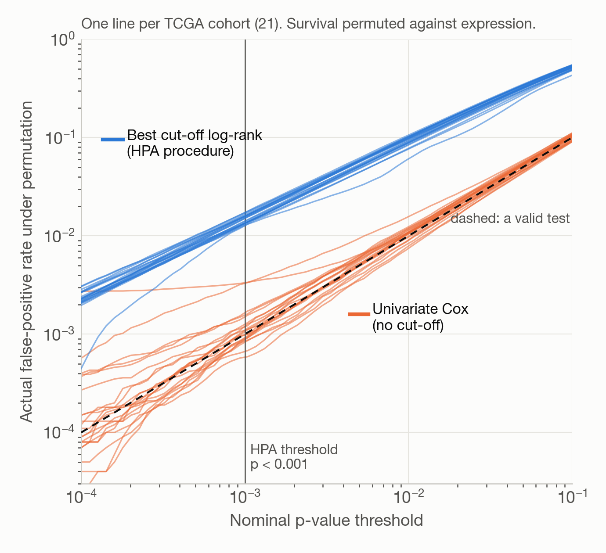
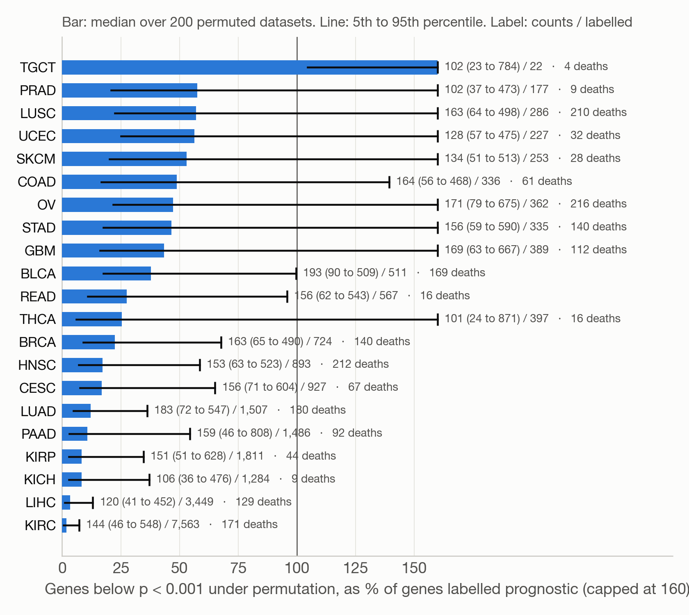
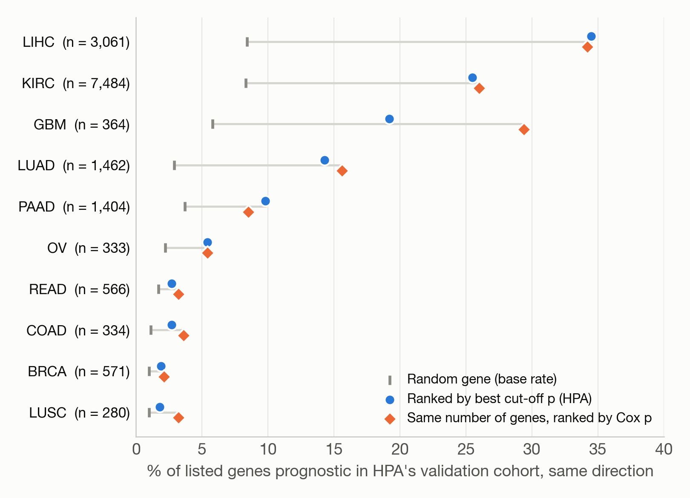

# How many of the Human Pathology Atlas v2 prognostic genes survive a valid test? A reproduction in all 21 TCGA cohorts

**Draft, 22 September 2026. Not peer reviewed and not yet seen by anyone who works in the field.** Written by Kim Dahlroth (no affiliation
in cancer research) with an AI coding agent. Everything below is computed from public files with public code; nothing here is a
biological claim. We are asking one question: is this useful to you, and if not, why not?

## What this is

We reproduced the prognostic gene analysis of the Human Pathology Atlas v2 (Yuan et al., eBioMedicine 2025;111:105495) from HPA's
public expression file (v25.1) and the TCGA-CDR overall-survival table, in Python, from the Methods text. Then we asked what the
label "prognostic" (best cut-off log-rank p < 0.001) means once the cut-off search is accounted for.

**None of the statistics is new.** That a p-value minimised over cut-offs is not a p-value has been known since Miller and Siegmund
(1982), Lausen and Schumacher (1992) and Altman et al. (1994), and Gilis et al. (bioRxiv 2020, doi 10.1101/2020.03.16.994038) made
exactly this criticism of the Pathology Atlas v1 in breast and liver cancer, including a permutation showing 1.88 % of genes below
0.001 under the null. That preprint was never published in a journal, and v2 uses the same procedure without mentioning the issue.
What we add is coverage (all 21 cohorts of v2, per-cohort numbers, per-gene corrected values) and three comparisons below.

## 1. The reproduction holds

6,912 patients against 6,918 in the article. Of HPA's 22,946 gene-cohort pairs with p < 0.001 we recover 22,477 (98 %). Spearman
correlation between our p-values and HPA's is 0.97 to 0.9996 in 20 cohorts and 0.90 in rectal cancer (16 deaths). Direction agrees for
93 to 99.8 %. Using the exact cut-off rule from the authors' R code (`generateKMplot`) instead of our reading of the Methods changes
nothing material, so the residual difference in rectum and colon is most likely the patient selection, which we could not determine.

## 2. At p < 0.001 the procedure's real false-positive rate is 1.25 to 1.73 %

We permuted survival against expression (400,000 null draws per cohort) and ran the identical procedure. Figure 1.

- The real false-positive rate at the nominal 0.001 is 12 to 17 times too high in every cohort.
- **A closed formula gives the same answer.** Lausen and Schumacher's correction, as implemented in R's `maxstat`, says that with a 20th
  to 80th percentile search p_min = 0.001 corresponds to 0.0169. Our permutation estimates are 0.74 to 1.02 times that value, lowest
  in cohorts with few deaths. A real 0.001 needs p_min below about 4e-5. No permutation is needed to fix this; it is one function call.
- With Benjamini-Hochberg at 5 % on corrected p-values, 12,504 (permutation) or 12,451 (formula) of the 23,506 labelled genes remain,
  and they sit in eight cohorts: KIRC 7,563, LIHC 3,428, KIRP 1,058, LUAD 326, KICH 95, HNSC 25, CESC 7, BRCA 2. In thirteen of
  twenty-one cohorts no individual gene can be established. Gilis et al. argue that permutation does not address gene-gene correlation
  or unmeasured confounding, so these counts are upper bounds.
- Several cohorts cannot support any test: TGCT has 4 deaths, PRAD 9, KICH 9, THCA 16, READ 16. TCGA-CDR itself (Liu et al., Cell 2018,
  Table 3) advises against overall survival in TGCT and urges caution in PRAD, KICH, THCA, READ and BRCA. KICH carries 1,284
  prognostic labels on nine deaths.

*Figure 1. Actual false-positive rate under permutation against the nominal threshold, one line per cohort. Blue: HPA's best cut-off
log-rank. Orange: univariate Cox on log2(pTPM + 1), likelihood-ratio test. The orange lines that leave the diagonal are TGCT (4 deaths)
and THCA (16).*

## 3. How many "prognostic" genes does chance alone produce in one dataset?

Section 2 gives the mean. Genes are correlated, so the count in a single dataset scatters far more than a binomial would. We permuted
survival 200 times per cohort and ran the procedure on all genes each time (`repro/07_antal_under_noll.py`). Figure 2.

- In a typical permuted dataset 100 to 190 genes come out "prognostic" (median). In one dataset in twenty it is 450 to 870. The worst
  of 200 draws gave 3,900 in THCA, 3,163 in KIRC, 2,676 in PAAD.
- **In ten of twenty-one cohorts the observed number of prognostic genes is within what permutation produces** (one-sided permutation
  p > 0.05 for the count): COAD, GBM, LUSC, OV, PRAD, SKCM, STAD, TGCT, THCA, UCEC. The whole-cohort claim "this cancer has n prognostic
  genes" is not supported there. READ (p = 0.050) and BLCA (0.055) are borderline. The other nine cohorts carry more signal than chance
  (p <= 0.025), with BRCA the weakest (724 observed against a 95th percentile of 490).
- The same correlation affects any per-gene multiple-testing correction. Under permutation, Cox with Benjamini-Hochberg at 5 % returned
  at least one "discovery" in 1.5 to 13.5 % of permuted datasets in cohorts with enough deaths, and when it did, often hundreds or
  thousands (HNSC up to 2,299, KIRC 3,534). This is the point Gilis et al. make, and it applies to every gene count in this note,
  including ours. Per-cohort counts are upper bounds; the whole-cohort permutation test above does not have this problem.

*Figure 2. Genes below p < 0.001 in a permuted dataset (bar: median, line: 5th to 95th percentile of 200 permutations) as a share of the genes HPA labels prognostic in that cohort. Above 100 % the labelled count is within chance.*

## 4. A test without a cut-off finds the same cancers, and more genes in pancreatic cancer

Univariate Cox regression on log2(pTPM + 1), likelihood-ratio test, Benjamini-Hochberg 5 %. Under the same permutations this test
holds its level (0.06 to 0.17 % at nominal 0.1 % in the seventeen cohorts with at least 28 deaths).

| Cohort | Deaths | HPA label | Best cut-off, corrected, BH 5 % | Cox, BH 5 % |
|---|---:|---:|---:|---:|
| KIRC | 171 | 7,563 | 7,563 | 7,853 |
| LIHC | 129 | 3,449 | 3,428 | 3,482 |
| PAAD | 92 | 1,486 | 0 | 2,380 |
| KIRP | 44 | 1,811 | 1,058 | 926 |
| LUAD | 180 | 1,507 | 326 | 750 |
| HNSC | 212 | 893 | 25 | 170 |
| CESC | 67 | 927 | 7 | 55 |
| Other fourteen | | 5,870 | 97 | 194 |
| Total | | 23,506 | 12,504 | 15,810 |

In seven cohorts Cox finds no gene at all (LUSC, OV, READ, SKCM, STAD, COAD, THCA), where HPA lists 253 to 567 each. In pancreatic
cancer the corrected best cut-off test cannot single out any gene while Cox finds 2,380: correcting the cut-off procedure keeps it
valid but costs power compared with not dichotomising in the first place. Do not read the Cox counts in TGCT (22), KICH (154) or PRAD
(2) as findings.

**Validation at equal list size (Figure 3).** Take as many genes as HPA labels prognostic, but rank by Cox p. The share that is
prognostic in the same direction in HPA's own validation cohort is equal or higher in eight of ten cohorts (GBM 29.4 vs 19.2 %,
LUSC 3.2 vs 1.8 %), lower in PAAD (8.5 vs 9.8 %) and marginally lower in LIHC (34.2 vs 34.5 %). The outcome is defined with HPA's
own procedure, which favours HPA's list, and is too generous in absolute terms for every list. In LUSC, BRCA, COAD and READ the
labelled genes validate in 1.8 to 2.7 % of cases against 1.0 to 1.7 % for a random gene: the label carries almost no information there.
HPA's own Figure 4d shows a significant overlap with validation cohorts in four of ten cancers, which is the same observation.

*Figure 3. Share of listed genes that are prognostic (p < 0.001, same direction) in HPA's validation cohort.*

## What we think follows, and what we do not know

1. The per-gene prognostic label on proteinatlas.org is informative in kidney (KIRC, KIRP), liver, lung adenocarcinoma and pancreatic
   cancer, weakly so in HNSC, CESC and BRCA, and indistinguishable from noise in ten cohorts. A user looking up one gene in one cancer cannot see the difference.
2. The smallest fix keeps HPA's procedure and replaces the p-value with `maxstat`'s corrected one, plus a multiple-testing adjustment.
   A larger fix is to rank by a continuous-expression Cox model and keep the cut-off only for drawing the Kaplan-Meier plot.
3. We do not know whether any of this matters for how the atlas is used. If the labels are only ever a starting point for wet-lab work,
   a high false-positive rate may be an accepted cost. That is the question we cannot answer ourselves.

Not done: no adjustment for age, stage or sex (Gilis et al. adjust for age); Breslow ties instead of R's Efron; the authors' R code
was read, not run; Altman 1994 and Lausen and Schumacher 1992 were not read in the original (paywalled), the formula was checked
against the `maxstat` source. Code and per-gene tables: every number above is produced by a numbered script in `repro/` with a fixed
seed, from three public files listed with checksums in `data/KALLOR.md`.
